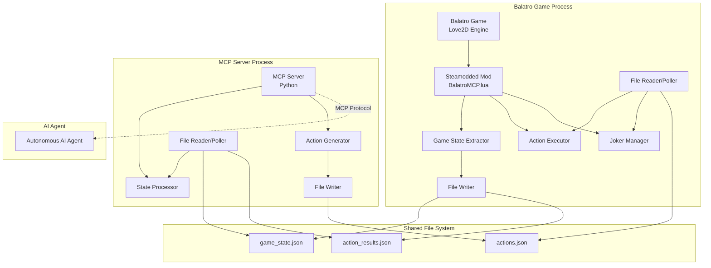
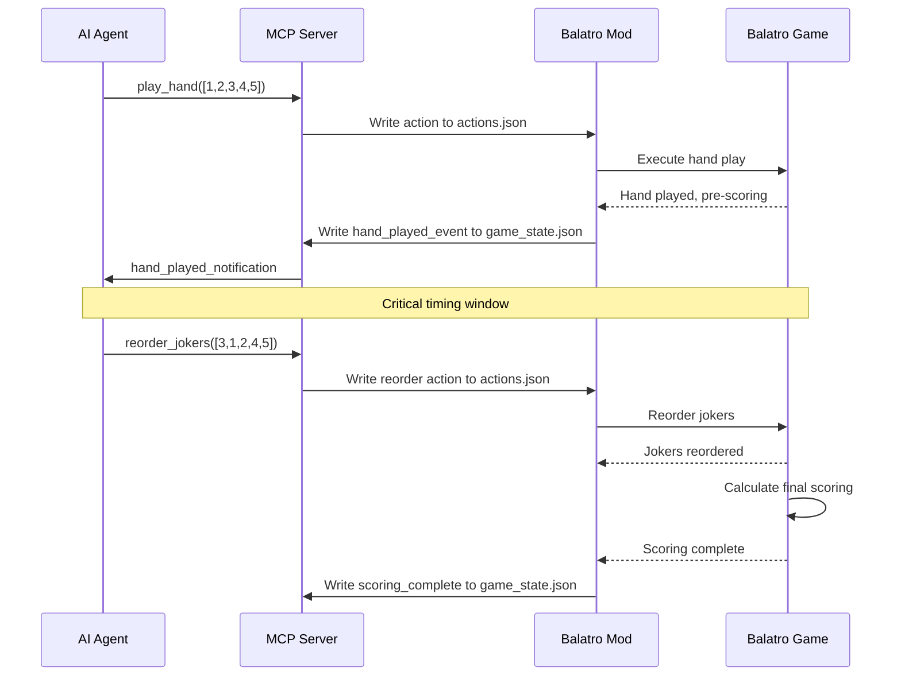

# Balatro MCP Server Architecture Plan

## Executive Summary

This document outlines the architecture for an MCP (Model Context Protocol) server that enables AI agents to interact with the card game Balatro through a Steamodded mod. The system uses a simplified file-based communication approach with Love2D's built-in file I/O capabilities.

## System Overview

The system consists of two main processes communicating via shared JSON files:

1. **Balatro Steamodded Mod** (Lua) - Extracts game state and executes AI-requested actions
2. **Python MCP Server** - Provides standardized MCP interface for AI agents

## Architecture Diagram



## File-Based Communication Protocol

### Communication Files

The system uses three JSON files for communication:

- **`game_state.json`** - Mod → MCP Server (game state updates)
- **`actions.json`** - MCP Server → Mod (action commands)  
- **`action_results.json`** - Mod → MCP Server (action execution results)

### Polling Mechanism

- **Balatro Mod**: Polls `actions.json` every game frame
- **MCP Server**: Polls `game_state.json` and `action_results.json` every 100ms
- Files include timestamps and sequence IDs for synchronization

### File Format Structure

```json
{
  "timestamp": "2024-01-01T12:00:00Z",
  "sequence_id": 123,
  "type": "game_state|action_command|action_result",
  "data": {...}
}
```

## MCP Server API Design

### MCP Tools

**Core Game Actions**:
1. `get_game_state()` - Retrieve current game state
2. `play_hand(card_indices: List[int])` - Play selected cards
3. `discard_cards(card_indices: List[int])` - Discard selected cards

**Shop and Navigation**:
4. `go_to_shop()` - Navigate to shop phase
5. `buy_item(shop_index: int)` - Purchase shop item
6. `sell_joker(joker_index: int)` - Sell joker from collection
7. `sell_consumable(consumable_index: int)` - Sell consumable card
8. `reroll_shop()` - Reroll shop contents

**Strategic Joker Management**:
9. `reorder_jokers(new_order: List[int])` - Reorder jokers (critical for Blueprint/Brainstorm strategy)

**Blind and Pack Management**:
10. `select_blind(blind_type: str)` - Choose blind type
11. `select_pack_offer(pack_index: int)` - Select from pack offers
12. `reroll_boss()` - Reroll boss blind options

**Hand Organization**:
13. `sort_hand_by_rank()` - Sort hand cards by rank
14. `sort_hand_by_suit()` - Sort hand cards by suit
15. `use_consumable(item_id: str)` - Use consumable card

### MCP Resources

- `balatro://game-state` - Current game state
- `balatro://available-actions` - Available actions list
- `balatro://joker-order` - Current joker arrangement

## Critical Feature: Post-Hand Joker Reordering

### Strategic Importance

The joker reordering feature is crucial for advanced Balatro strategy:

- **Timing**: After playing a hand but before final scoring calculations
- **Purpose**: Allows reordering jokers to optimize Blueprint/Brainstorm copying
- **Impact**: Affects gold card and blue seal value generation order
- **Strategy**: Enables copying Mime with Blueprint/Brainstorm instead of scoring jokers

### Implementation Sequence



## Love2D File I/O Implementation

### Mod Side (Lua)

```lua
-- Write game state
function write_game_state(state)
    local data = {
        timestamp = os.date("!%Y-%m-%dT%H:%M:%SZ"),
        sequence_id = get_next_sequence_id(),
        type = "game_state",
        data = state
    }
    love.filesystem.write("balatro_mcp/game_state.json", json.encode(data))
end

-- Poll for actions
function poll_for_actions()
    if love.filesystem.getInfo("balatro_mcp/actions.json") then
        local content = love.filesystem.read("balatro_mcp/actions.json")
        local action_data = json.decode(content)
        if action_data.sequence_id > last_processed_action then
            execute_action(action_data.data)
            love.filesystem.remove("balatro_mcp/actions.json")
            last_processed_action = action_data.sequence_id
        end
    end
end

-- Game loop integration
function love.update(dt)
    -- Regular game update
    original_love_update(dt)
    
    -- MCP polling
    poll_for_actions()
    
    -- State updates at decision points
    if game_state_changed then
        write_game_state(extract_current_state())
        game_state_changed = false
    end
end
```

### MCP Server Side (Python)

```python
import json
import time
from pathlib import Path

class BalatroFileIO:
    def __init__(self, base_path="balatro_mcp"):
        self.base_path = Path(base_path)
        self.base_path.mkdir(exist_ok=True)
        self.sequence_id = 0
    
    def poll_game_state(self):
        state_file = self.base_path / "game_state.json"
        if state_file.exists():
            try:
                with open(state_file, 'r') as f:
                    return json.load(f)
            except (json.JSONDecodeError, IOError):
                return None
        return None
    
    def write_action(self, action_data):
        self.sequence_id += 1
        action_file = self.base_path / "actions.json"
        with open(action_file, 'w') as f:
            json.dump({
                "timestamp": time.strftime("%Y-%m-%dT%H:%M:%SZ", time.gmtime()),
                "sequence_id": self.sequence_id,
                "type": "action_command", 
                "data": action_data
            }, f)
    
    def poll_action_results(self):
        result_file = self.base_path / "action_results.json"
        if result_file.exists():
            try:
                with open(result_file, 'r') as f:
                    data = json.load(f)
                result_file.unlink()  # Remove after reading
                return data
            except (json.JSONDecodeError, IOError):
                return None
        return None
```

## Game State Schema

```json
{
  "session_id": "uuid-string",
  "current_phase": "hand_selection|shop|blind_selection|scoring",
  "ante": 1,
  "money": 150,
  "hands_remaining": 4,
  "discards_remaining": 3,
  "hand_cards": [
    {
      "id": "card_1",
      "rank": "A",
      "suit": "hearts",
      "enhancement": "gold|steel|glass|wild|bonus|mult|stone|none",
      "edition": "foil|holographic|polychrome|negative|none",
      "seal": "red|blue|gold|purple|none"
    }
  ],
  "jokers": [
    {
      "id": "joker_1",
      "name": "Blueprint",
      "position": 0,
      "properties": {...}
    }
  ],
  "consumables": [...],
  "current_blind": {
    "name": "Big Blind",
    "type": "big|small|boss",
    "requirement": 300,
    "reward": 5
  },
  "shop_contents": [...],
  "available_actions": ["play_hand", "discard", "go_to_shop", ...],
  "post_hand_joker_reorder_available": false
}
```

## Implementation Benefits

1. **Simplicity** - No networking dependencies, uses only Love2D's built-in file system
2. **Debuggability** - All communication visible as JSON files
3. **Cross-Platform** - Works wherever Love2D file I/O works
4. **Crash Resilience** - File-based state survives process crashes
5. **Easy Testing** - Can manually write action files for testing
6. **No External Dependencies** - Minimal requirements for both mod and server

## File Structure

```
balatro-mcp/
├── mod/
│   ├── BalatroMCP.lua          # Main mod file
│   ├── state_extractor.lua     # Game state extraction
│   ├── action_executor.lua     # Action execution
│   ├── joker_manager.lua       # Joker reordering logic
│   ├── file_io.lua             # File I/O and polling
│   └── manifest.json           # Steamodded manifest
├── server/
│   ├── main.py                 # MCP server entry point
│   ├── state_manager.py        # State processing
│   ├── action_handler.py       # Action processing
│   ├── file_io.py              # File polling and writing
│   └── schemas.py              # Data schemas
├── shared/
│   ├── game_state.json         # Current game state
│   ├── actions.json            # Pending actions
│   └── action_results.json     # Action execution results
├── docs/
│   ├── API.md                  # API documentation
│   ├── SETUP.md                # Installation guide
│   └── FILE_PROTOCOL.md        # File communication spec
└── examples/
    ├── basic_agent.py          # Simple AI agent example
    └── joker_strategy.py       # Blueprint/Brainstorm examples
```

## Implementation Phases

### Phase 1: Core Infrastructure
- Basic Steamodded mod with file I/O
- Simple MCP server with state extraction
- Core actions: hand play, discard, basic shop navigation

### Phase 2: Strategic Actions
- Joker and consumable selling
- Post-hand joker reordering system
- Pack selection and boss rerolling

### Phase 3: Advanced Features
- Hand sorting capabilities
- Complete action validation and error handling
- Performance optimization

## Technical Challenges & Solutions

### Challenge 1: File Synchronization
**Issue**: Ensuring consistent state between processes
**Solution**: Sequence IDs and atomic file operations

### Challenge 2: Timing Precision
**Issue**: Joker reordering must happen at precise moments
**Solution**: Game state flags and event-driven updates

### Challenge 3: File Locking
**Issue**: Concurrent file access
**Solution**: Atomic write operations and retry logic

### Challenge 4: Error Recovery
**Issue**: Handling corrupted or missing files
**Solution**: Graceful fallbacks and state reconstruction

## Conclusion

This architecture provides a robust, simple, and extensible foundation for AI agents to interact with Balatro through a standardized MCP interface. The file-based communication approach eliminates networking complexity while maintaining all necessary strategic functionality, particularly the critical joker reordering feature for advanced gameplay strategies.

The system is designed to be easily implementable, debuggable, and maintainable while providing the full range of actions needed for autonomous AI gameplay in Balatro.