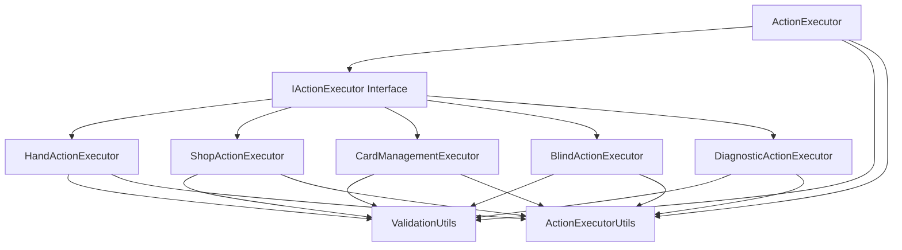

# ActionExecutor Modular Refactoring Specification

## Executive Summary

The current `action_executor.lua` is a 800-line monolithic class that handles 18 different action types through a large if-else dispatcher. This specification outlines a comprehensive refactoring plan to break it into specialized, focused modules following the successful state_extractor refactoring pattern.

**Key Benefits:**
- **Maintainability**: Smaller, focused modules easier to understand and modify
- **Testability**: Individual executors can be tested in isolation
- **Extensibility**: New action types can be added without modifying the main orchestrator
- **Single Responsibility**: Each executor handles a specific domain of actions

## Current Architecture Analysis

### Problems with Monolithic Design
- **800 lines** in a single file with complex interdependencies
- **Large dispatcher method** with 18 if-else branches (lines 54-95)
- **Mixed concerns**: Validation, execution, and business logic intermixed
- **Code duplication**: Validation logic repeated across methods
- **Difficult testing**: Cannot test individual action groups in isolation

### Action Grouping Analysis
Current actions can be logically grouped into 5 domains:

1. **Hand Actions (5 actions)**: play_hand, discard_cards, sort_hand_by_rank, sort_hand_by_suit, move_playing_card
2. **Shop Actions (4 actions)**: go_to_shop, buy_item, reroll_shop, go_next
3. **Card Management Actions (4 actions)**: sell_joker, sell_consumable, reorder_jokers, use_consumable
4. **Blind Actions (4 actions)**: select_blind, skip_blind, reroll_boss, select_pack_offer
5. **Diagnostic Actions (2 actions)**: diagnose_blind_progression, diagnose_blind_activation

## Target Architecture

### Modular Structure (Following StateExtractor Pattern)

```
action_executor/
├── action_executor.lua                    # Main orchestrator (facade)
├── executors/
│   ├── i_action_executor.lua             # Interface definition
│   ├── hand_action_executor.lua          # Hand-related actions
│   ├── shop_action_executor.lua          # Shop-related actions
│   ├── card_management_executor.lua      # Card management actions
│   ├── blind_action_executor.lua         # Blind-related actions
│   └── diagnostic_action_executor.lua    # Diagnostic actions
└── utils/
    ├── validation_utils.lua              # Shared validation logic
    └── action_executor_utils.lua         # Shared utilities
```

### Architecture Diagram



### Interface Design

```lua
-- IActionExecutor Interface
function IActionExecutor:execute(action_type, action_data)
    -- Execute specific action type
end

function IActionExecutor:get_supported_actions()
    -- Return list of supported action types
end

function IActionExecutor:get_name()
    -- Return executor name
end
```

## Implementation Plan

### Sprint 1: Foundation and Utilities (1 week)
**Goal**: Create the foundation and shared utilities without breaking existing functionality

#### Issues for Sprint 1
- [ ] **Create modular directory structure** - Estimated effort: 1 hour
  - Description: Create `action_executor/` directory with `executors/` and `utils/` subdirectories
  - Acceptance Criteria: Directory structure matches specification
  - Dependencies: None

- [ ] **Implement IActionExecutor interface** - Estimated effort: 2 hours
  - Description: Create interface definition with validation methods
  - Acceptance Criteria: Interface provides contract for all action executors
  - Dependencies: Directory structure

- [ ] **Extract ValidationUtils** - Estimated effort: 4 hours
  - Description: Move validation logic from main class to shared utility
  - Acceptance Criteria: All validation methods moved and working
  - Dependencies: Interface created

- [ ] **Extract ActionExecutorUtils** - Estimated effort: 3 hours
  - Description: Create shared utilities for common operations
  - Acceptance Criteria: Utility methods available for all executors
  - Dependencies: ValidationUtils completed

#### Sprint 1 Deliverables
- Complete modular directory structure
- IActionExecutor interface with validation
- ValidationUtils with all shared validation logic
- ActionExecutorUtils with common operations
- All existing tests still passing

### Sprint 2: Core Action Executors (2 weeks)
**Goal**: Implement specialized action executors for each domain

#### Issues for Sprint 2
- [ ] **Implement HandActionExecutor** - Estimated effort: 8 hours
  - Description: Create executor for hand-related actions (play_hand, discard_cards, sort_*, move_playing_card)
  - Acceptance Criteria: All 5 hand actions work identically to current implementation
  - Dependencies: Foundation completed

- [ ] **Implement ShopActionExecutor** - Estimated effort: 10 hours
  - Description: Create executor for shop-related actions (go_to_shop, buy_item, reroll_shop, go_next)
  - Acceptance Criteria: All 4 shop actions work identically, including complex buy_item logic
  - Dependencies: Foundation completed

- [ ] **Implement CardManagementExecutor** - Estimated effort: 6 hours
  - Description: Create executor for card management actions (sell_joker, sell_consumable, reorder_jokers, use_consumable)
  - Acceptance Criteria: All 4 card management actions work identically
  - Dependencies: Foundation completed

- [ ] **Implement BlindActionExecutor** - Estimated effort: 8 hours
  - Description: Create executor for blind-related actions (select_blind, skip_blind, reroll_boss, select_pack_offer)
  - Acceptance Criteria: All 4 blind actions work identically, including complex UI interaction logic
  - Dependencies: Foundation completed

- [ ] **Implement DiagnosticActionExecutor** - Estimated effort: 4 hours
  - Description: Create executor for diagnostic actions (diagnose_blind_progression, diagnose_blind_activation)
  - Acceptance Criteria: Both diagnostic actions work identically
  - Dependencies: Foundation completed

#### Sprint 2 Deliverables
- 5 specialized action executors
- All 18 action types implemented in modular form
- Comprehensive unit tests for each executor
- Integration tests proving equivalence to monolithic version

### Sprint 3: Orchestrator and Integration (1 week)
**Goal**: Create the main orchestrator and integrate all executors

#### Issues for Sprint 3
- [ ] **Implement ActionExecutor orchestrator** - Estimated effort: 6 hours
  - Description: Create main facade that coordinates all specialized executors
  - Acceptance Criteria: Main class provides identical interface to current monolithic version
  - Dependencies: All executors completed

- [ ] **Implement action routing logic** - Estimated effort: 4 hours
  - Description: Replace large if-else chain with dynamic routing to appropriate executor
  - Acceptance Criteria: All actions route correctly to appropriate executor
  - Dependencies: Orchestrator created

- [ ] **Add error handling and logging** - Estimated effort: 3 hours
  - Description: Ensure comprehensive error handling and consistent logging
  - Acceptance Criteria: Error handling matches or exceeds current implementation
  - Dependencies: Routing logic completed

- [ ] **Update SMODS loading patterns** - Estimated effort: 2 hours
  - Description: Apply `assert(SMODS.load_file("path.lua"))()` pattern consistently
  - Acceptance Criteria: All modules load correctly in Steamodded environment
  - Dependencies: All modules implemented

#### Sprint 3 Deliverables
- Complete modular ActionExecutor with facade pattern
- Dynamic action routing system
- Comprehensive error handling and logging
- SMODS-compatible module loading
- Full integration tests

### Sprint 4: Testing and Validation (1 week)
**Goal**: Ensure comprehensive testing and validate migration success

#### Issues for Sprint 4
- [ ] **Update existing tests for modular architecture** - Estimated effort: 8 hours
  - Description: Modify existing test_action_executor_luaunit.lua to work with new architecture
  - Acceptance Criteria: All existing tests pass with new architecture
  - Dependencies: Modular architecture completed

- [ ] **Create individual executor tests** - Estimated effort: 6 hours
  - Description: Create focused test suites for each specialized executor
  - Acceptance Criteria: Each executor has comprehensive test coverage
  - Dependencies: All executors implemented

- [ ] **Add integration tests** - Estimated effort: 4 hours
  - Description: Create tests that verify end-to-end functionality
  - Acceptance Criteria: Integration tests prove equivalence to monolithic version
  - Dependencies: Individual tests completed

- [ ] **Performance validation** - Estimated effort: 2 hours
  - Description: Ensure modular architecture doesn't negatively impact performance
  - Acceptance Criteria: Performance is equivalent or better than monolithic version
  - Dependencies: All tests passing

#### Sprint 4 Deliverables
- Comprehensive test suite for modular architecture
- Individual executor test suites
- Integration tests proving equivalence
- Performance validation results
- Migration considered complete

## Risk Assessment and Mitigation

### Technical Risks
- **Interface Compatibility**: New modular interface might not match existing usage patterns
  - **Mitigation**: Maintain identical public interface in orchestrator facade
- **Performance Impact**: Modular architecture might introduce overhead
  - **Mitigation**: Benchmark performance and optimize if needed
- **Complex Action Logic**: Some actions (like buy_item) have complex state management
  - **Mitigation**: Migrate complex logic incrementally with extensive testing

### Project Risks
- **Test Compatibility**: Existing tests might require significant updates
  - **Mitigation**: Update tests incrementally, maintaining backward compatibility
- **Integration Issues**: Modular components might not integrate correctly
  - **Mitigation**: Implement comprehensive integration tests early
- **Timeline Pressure**: Refactoring might take longer than estimated
  - **Mitigation**: Prioritize core functionality first, optimize later

## Migration Strategy

### Phase 1: Parallel Implementation
- Create modular structure alongside existing monolithic class
- Implement new executors without removing old code
- Validate equivalence through comprehensive testing

### Phase 2: Gradual Migration
- Route actions through new modular system
- Keep old methods as fallbacks during transition
- Monitor for any behavioral differences

### Phase 3: Complete Replacement
- Remove old monolithic methods once validation complete
- Clean up any temporary compatibility code
- Finalize test suite for new architecture

### No Shim Layer Approach
Following the state_extractor pattern, we will avoid persistent shim layers:
- **Direct Migration**: New orchestrator directly replaces old class
- **Interface Preservation**: Maintain identical public interface
- **Clean Cutover**: Remove old code once migration validated

## Success Metrics

### Functional Metrics
- **100% Action Compatibility**: All 18 actions work identically to current implementation
- **Test Suite Passage**: All existing tests pass with new architecture
- **Integration Success**: Full end-to-end functionality verified

### Quality Metrics
- **Code Modularity**: Average file size under 200 lines (down from 800)
- **Test Coverage**: Each executor has dedicated test suite
- **Maintainability**: Clear separation of concerns achieved

### Performance Metrics
- **Action Execution Time**: No performance degradation
- **Memory Usage**: Equivalent or better memory footprint
- **Loading Time**: Module loading time acceptable

## Backwards Compatibility

### Public Interface Preservation
The main ActionExecutor class will maintain identical public methods:
- `ActionExecutor.new(state_extractor, joker_manager)`
- `executor:execute_action(action_data)`
- All existing method signatures preserved

### Internal Architecture Changes
While internal architecture changes completely, external usage remains identical:
```lua
-- This code continues to work unchanged
local executor = ActionExecutor.new(state_extractor, joker_manager)
local result = executor:execute_action({action_type = "play_hand", card_indices = {0, 1, 2}})
```

## Implementation Guidelines

### Code Style Consistency
- Follow existing Lua conventions in codebase
- Use defensive programming patterns (nil checks, error handling)
- Maintain consistent error message formats
- Apply SMODS loading patterns consistently

### Testing Strategy
- **Unit Tests**: Each executor tested in isolation
- **Integration Tests**: Full action execution cycle tested
- **Regression Tests**: Ensure no functionality lost
- **Performance Tests**: Validate no performance degradation

### Documentation Requirements
- **Interface Documentation**: Clear contracts for all interfaces
- **Migration Guide**: Document changes for other developers
- **Architecture Decisions**: Record rationale for design choices
- **Troubleshooting Guide**: Common issues and solutions

## Conclusion

This refactoring transforms the monolithic 800-line ActionExecutor into a modular, maintainable architecture following proven patterns from the state_extractor refactoring. The migration preserves all existing functionality while dramatically improving code organization, testability, and maintainability.

The phased approach minimizes risk while ensuring comprehensive validation of the new architecture. Upon completion, the ActionExecutor will be significantly easier to maintain, extend, and test.