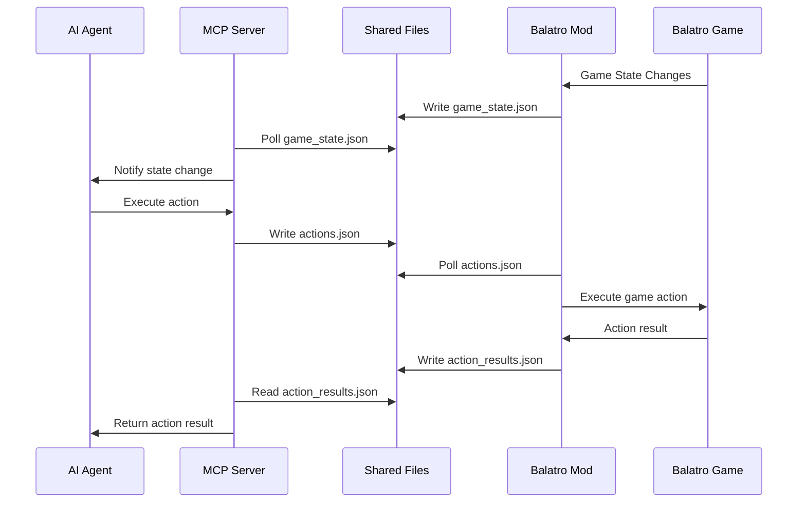

# Developer Guide: Extending Balatro MCP

> **Dive deep into the system's core.** Unlock the secrets of extending, customizing, and mastering the Balatro MCP architecture. This is where power users become system architects.

## Architecture Deep Dive

**Understanding the neural pathways of the system.**

### System Components

The Balatro MCP system operates through three interconnected layers:

```
┌─────────────────────────────────────────────────────────────┐
│                    AI Agent Layer                           │
│  • Your custom AI logic                                     │
│  • MCP client implementation                                │
│  • Strategy algorithms                                      │
└─────────────────┬───────────────────────────────────────────┘
                  │ MCP Protocol
┌─────────────────▼───────────────────────────────────────────┐
│               Python MCP Server                             │
│  • server/main.py          - MCP server core               │
│  • server/state_manager.py - Game state tracking           │
│  • server/action_handler.py - Action validation/execution  │
│  • server/file_io.py       - Communication protocol        │
│  • server/schemas.py       - Data structures               │
└─────────────────┬───────────────────────────────────────────┘
                  │ File-based JSON Communication
┌─────────────────▼───────────────────────────────────────────┐
│                 Balatro Mod Layer                           │
│  • mod/BalatroMCP.lua      - Main mod coordinator          │
│  • mod/state_extractor.lua - Game state extraction         │
│  • mod/action_executor.lua - Action implementation         │
│  • mod/joker_manager.lua   - Joker reordering system       │
│  • mod/file_io.lua         - File communication            │
└─────────────────────────────────────────────────────────────┘
```

### Component Responsibilities

#### Python MCP Server
**The intelligent broker.** Handles AI agent communication and validates all strategic decisions.

- **State Management**: Real-time game state tracking with change detection
- **Action Validation**: Pre-execution validation of all game actions
- **Communication Protocol**: File-based message exchange with atomic operations
- **Error Handling**: Comprehensive error reporting and recovery

#### Balatro Mod
**The game infiltrator.** Embedded deep within Balatro's execution environment.

- **State Extraction**: Real-time game state harvesting
- **Action Execution**: Direct manipulation of game mechanics
- **Hook Management**: Strategic insertion into game event flows
- **Timing Control**: Precise joker reordering window management

### Communication Protocol

**The nervous system of the integration.**

#### Message Flow


#### File Structure
```json
// shared/game_state.json - Mod → Server
{
  "timestamp": "ISO 8601",
  "sequence_id": "monotonic_integer",
  "message_type": "game_state",
  "data": "GameState_object"
}

// shared/actions.json - Server → Mod  
{
  "timestamp": "ISO 8601",
  "sequence_id": "monotonic_integer", 
  "message_type": "action_command",
  "data": "GameAction_object"
}

// shared/action_results.json - Mod → Server
{
  "timestamp": "ISO 8601",
  "sequence_id": "monotonic_integer",
  "message_type": "action_result", 
  "data": "ActionResult_object"
}
```

## Adding New Game Actions

**Extend the system's capabilities with surgical precision.**

### Step 1: Define the Action Schema

Add your new action to [`server/schemas.py`](../server/schemas.py):

```python
class CustomAction(BaseModel):
    """Your new strategic action."""
    
    action_type: Literal["custom_action"] = "custom_action"
    custom_parameter: int
    optional_parameter: Optional[str] = None

# Add to the GameAction union
GameAction = Union[
    PlayHandAction,
    DiscardCardsAction,
    # ... existing actions
    CustomAction,  # Your new action
]
```

### Step 2: Implement Server-Side Validation

Add validation logic to [`server/action_handler.py`](../server/action_handler.py):

```python
class BalatroActionHandler(IActionHandler):
    def __init__(self, file_io: IFileIO, state_manager: IStateManager):
        # Add validator to the mapping
        self.action_validators = {
            # ... existing validators
            "custom_action": self._validate_custom_action,
        }
    
    async def _validate_custom_action(
        self, action: CustomAction, state: GameState
    ) -> bool:
        """Validate your custom action."""
        # Implement validation logic
        if state.current_phase != GamePhase.HAND_SELECTION:
            return False
        
        if action.custom_parameter < 0:
            return False
            
        # Check game state requirements
        if not self._check_custom_requirements(state):
            return False
            
        return True
    
    def _check_custom_requirements(self, state: GameState) -> bool:
        """Custom validation logic."""
        # Implement your specific requirements
        return True
```

### Step 3: Add MCP Tool Definition

Update the tool list in [`server/main.py`](../server/main.py):

```python
async def get_available_tools(self) -> List[Tool]:
    return [
        # ... existing tools
        Tool(
            name="custom_action",
            description="Execute your custom strategic action",
            inputSchema={
                "type": "object",
                "properties": {
                    "custom_parameter": {
                        "type": "integer", 
                        "description": "Your custom parameter"
                    },
                    "optional_parameter": {
                        "type": "string",
                        "description": "Optional parameter",
                        "default": None
                    }
                },
                "required": ["custom_parameter"]
            }
        )
    ]

async def _create_action_from_tool(
    self, tool_name: str, arguments: Dict[str, Any]
) -> Optional[GameAction]:
    # Add action creation logic
    if tool_name == "custom_action":
        return CustomAction(
            custom_parameter=arguments["custom_parameter"],
            optional_parameter=arguments.get("optional_parameter")
        )
    # ... existing action creation
```

### Step 4: Implement Mod-Side Execution

Add execution logic to [`mod/action_executor.lua`](../mod/action_executor.lua):

```lua
-- ActionExecutor class extension
function ActionExecutor:execute_custom_action(action_data)
    self.debug_logger:info("Executing custom action: " .. tostring(action_data.custom_parameter), "ACTION")
    
    -- Validate action in Lua context
    if not self:validate_custom_action(action_data) then
        return {
            success = false,
            error_message = "Custom action validation failed"
        }
    end
    
    -- Execute the action
    local success, error_msg = pcall(function()
        self:perform_custom_action(action_data)
    end)
    
    if success then
        return {
            success = true,
            error_message = nil,
            new_state = self.state_extractor:extract_current_state()
        }
    else
        return {
            success = false,
            error_message = error_msg or "Custom action execution failed"
        }
    end
end

function ActionExecutor:validate_custom_action(action_data)
    -- Implement Lua-side validation
    if not action_data.custom_parameter then
        return false
    end
    
    if action_data.custom_parameter < 0 then
        return false
    end
    
    -- Check game state requirements
    local current_state = self.state_extractor:extract_current_state()
    if not current_state or current_state.game_phase ~= "hand_selection" then
        return false
    end
    
    return true
end

function ActionExecutor:perform_custom_action(action_data)
    -- Implement the actual game manipulation
    self.debug_logger:info("Performing custom action with parameter: " .. action_data.custom_parameter, "ACTION")
    
    -- Your custom game manipulation code here
    -- Access Balatro's internal state through G global
    -- Modify game elements as needed
    
    -- Example: Manipulate cards based on parameter
    if G.hand and G.hand.cards then
        for i = 1, math.min(action_data.custom_parameter, #G.hand.cards) do
            local card = G.hand.cards[i]
            -- Perform card manipulation
        end
    end
end

-- Add to action dispatch table
function ActionExecutor:execute_action(action_data)
    local action_type = action_data.action_type
    
    if action_type == "custom_action" then
        return self:execute_custom_action(action_data)
    end
    
    -- ... existing action handling
end
```

### Step 5: Test Your Action

Create comprehensive tests in [`server/tests/test_action_handler.py`](../server/tests/test_action_handler.py):

```python
class TestCustomAction:
    """Test suite for custom action functionality."""
    
    @pytest.mark.asyncio
    async def test_custom_action_validation_success(self, action_handler, mock_state):
        """Test successful custom action validation."""
        action = CustomAction(custom_parameter=10)
        mock_state.current_phase = GamePhase.HAND_SELECTION
        
        result = await action_handler.validate_action(action, mock_state)
        assert result is True
    
    @pytest.mark.asyncio
    async def test_custom_action_validation_failure(self, action_handler, mock_state):
        """Test custom action validation failure."""
        action = CustomAction(custom_parameter=-1)
        mock_state.current_phase = GamePhase.HAND_SELECTION
        
        result = await action_handler.validate_action(action, mock_state)
        assert result is False
    
    @pytest.mark.asyncio
    async def test_custom_action_execution(self, action_handler, mock_file_io, mock_state):
        """Test complete custom action execution."""
        action = CustomAction(custom_parameter=5)
        mock_state.current_phase = GamePhase.HAND_SELECTION
        mock_state.available_actions = ["custom_action"]
        
        # Mock successful execution
        mock_file_io.write_action.return_value = True
        mock_file_io.wait_for_action_result.return_value = ActionResult(success=True)
        
        result = await action_handler.execute_action(action)
        assert result.success is True
```

## Extending Game State Extraction

**Harvest deeper intelligence from Balatro's internal state.**

### Understanding Balatro's Internal Structure

The game exposes its state through the global `G` object:

```lua
-- Key game state locations
G.GAME                    -- Core game state
G.GAME.round             -- Current round
G.GAME.dollars           -- Player money  
G.GAME.current_round     -- Round information

G.hand                   -- Player's hand
G.hand.cards             -- Array of hand cards

G.jokers                 -- Joker collection
G.jokers.cards           -- Array of joker cards

G.consumeables           -- Consumable cards
G.consumeables.cards     -- Array of consumables

G.GAME.blind             -- Current blind information
G.GAME.shop              -- Shop state
```

### Adding New State Fields

Extend [`mod/state_extractor.lua`](../mod/state_extractor.lua):

```lua
function StateExtractor:extract_current_state()
    local state = {
        -- ... existing state extraction
        
        -- Add your custom state fields
        custom_field = self:extract_custom_field(),
        advanced_metrics = self:calculate_advanced_metrics(),
        strategic_analysis = self:perform_strategic_analysis()
    }
    
    return state
end

function StateExtractor:extract_custom_field()
    -- Extract specific game information
    if not G.GAME then
        return nil
    end
    
    return {
        custom_value = G.GAME.custom_property or 0,
        calculated_metric = self:calculate_custom_metric(),
        game_flags = self:extract_game_flags()
    }
end

function StateExtractor:calculate_advanced_metrics()
    -- Perform complex calculations on game state
    local metrics = {}
    
    -- Calculate hand strength
    if G.hand and G.hand.cards then
        metrics.hand_strength = self:calculate_hand_strength(G.hand.cards)
        metrics.hand_potential = self:calculate_hand_potential(G.hand.cards)
    end
    
    -- Calculate joker synergies
    if G.jokers and G.jokers.cards then
        metrics.joker_synergy = self:calculate_joker_synergy(G.jokers.cards)
        metrics.joker_efficiency = self:calculate_joker_efficiency(G.jokers.cards)
    end
    
    return metrics
end

function StateExtractor:perform_strategic_analysis()
    -- High-level strategic assessment
    local analysis = {}
    
    -- Assess current position strength
    analysis.position_strength = self:assess_position_strength()
    
    -- Calculate optimal strategies
    analysis.optimal_plays = self:calculate_optimal_plays()
    
    -- Assess risk factors
    analysis.risk_assessment = self:assess_current_risks()
    
    return analysis
end
```

### Update Python Schema

Reflect new fields in [`server/schemas.py`](../server/schemas.py):

```python
class CustomField(BaseModel):
    """Custom state field structure."""
    custom_value: int
    calculated_metric: float
    game_flags: Dict[str, bool]

class AdvancedMetrics(BaseModel):
    """Advanced game metrics."""
    hand_strength: float
    hand_potential: float
    joker_synergy: float
    joker_efficiency: float

class StrategicAnalysis(BaseModel):
    """Strategic assessment data."""
    position_strength: float
    optimal_plays: List[str]
    risk_assessment: Dict[str, float]

class GameState(BaseModel):
    """Enhanced game state with custom fields."""
    # ... existing fields
    
    # New custom fields
    custom_field: Optional[CustomField] = None
    advanced_metrics: Optional[AdvancedMetrics] = None
    strategic_analysis: Optional[StrategicAnalysis] = None
```

## Testing and Debugging Framework

**Ensure system reliability with comprehensive testing.**

### Unit Testing Structure

The testing framework provides complete coverage:

```
server/tests/
├── __init__.py                 # Test package initialization
├── conftest.py                # Pytest fixtures and configuration
├── test_schemas.py            # Data structure validation tests
├── test_file_io.py            # File communication tests
├── test_state_manager.py      # State management tests
├── test_action_handler.py     # Action validation and execution tests
└── test_main.py               # Integration and MCP server tests
```

### Creating Comprehensive Test Suites

#### Action Handler Testing
```python
# server/tests/test_action_handler.py
class TestCustomActionSuite:
    """Comprehensive test suite for custom actions."""
    
    @pytest.fixture
    def custom_action(self):
        return CustomAction(custom_parameter=10)
    
    @pytest.fixture  
    def mock_game_state(self):
        return GameState(
            session_id="test-session",
            current_phase=GamePhase.HAND_SELECTION,
            ante=1,
            money=50,
            hands_remaining=4,
            discards_remaining=3,
            hand_cards=[],
            jokers=[],
            consumables=[],
            current_blind=None,
            shop_contents=[],
            available_actions=["custom_action"],
            post_hand_joker_reorder_available=False
        )
    
    @pytest.mark.asyncio
    async def test_action_validation_edge_cases(self, action_handler, mock_game_state):
        """Test validation with edge case scenarios."""
        test_cases = [
            (CustomAction(custom_parameter=0), True, "Zero parameter should be valid"),
            (CustomAction(custom_parameter=-1), False, "Negative parameter should be invalid"),
            (CustomAction(custom_parameter=999), True, "Large parameter should be valid"),
        ]
        
        for action, expected, message in test_cases:
            result = await action_handler.validate_action(action, mock_game_state)
            assert result == expected, message
    
    @pytest.mark.asyncio
    async def test_action_execution_error_handling(self, action_handler, mock_file_io):
        """Test error handling during action execution."""
        action = CustomAction(custom_parameter=10)
        
        # Simulate file I/O failure
        mock_file_io.write_action.return_value = False
        
        result = await action_handler.execute_action(action)
        assert result.success is False
        assert "Failed to write action to file" in result.error_message
    
    @pytest.mark.asyncio
    async def test_action_timeout_handling(self, action_handler, mock_file_io):
        """Test timeout scenarios."""
        action = CustomAction(custom_parameter=10)
        
        # Simulate timeout
        mock_file_io.write_action.return_value = True
        mock_file_io.wait_for_action_result.return_value = None
        
        result = await action_handler.execute_action(action)
        assert result.success is False
        assert "Timeout waiting for action result" in result.error_message
```

#### State Management Testing
```python
# server/tests/test_state_manager.py
class TestStateManager:
    """Test state management functionality."""
    
    @pytest.mark.asyncio
    async def test_state_change_detection(self, state_manager, mock_file_io):
        """Test accurate state change detection."""
        # Initial state
        initial_state = create_test_game_state(ante=1, money=50)
        mock_file_io.read_game_state.return_value = initial_state
        
        # First read should detect change
        changed = await state_manager.is_state_changed()
        assert changed is True
        
        # Second read with same state should not detect change
        changed = await state_manager.is_state_changed()
        assert changed is False
        
        # Updated state should detect change
        updated_state = create_test_game_state(ante=1, money=60)
        mock_file_io.read_game_state.return_value = updated_state
        
        changed = await state_manager.is_state_changed()
        assert changed is True
```

### Integration Testing

Test complete end-to-end workflows:

```python
class TestIntegrationWorkflows:
    """Test complete AI agent workflows."""
    
    @pytest.mark.asyncio
    async def test_complete_hand_play_workflow(self, mcp_server):
        """Test complete hand play from AI agent perspective."""
        # Simulate game state with playable hand
        game_state = create_game_state_with_hand()
        
        # Test tool call
        result = await mcp_server.handle_tool_call("play_hand", {
            "card_indices": [0, 1, 2, 3, 4]
        })
        
        assert result["success"] is True
        assert "play_hand" in result["tool"]
    
    @pytest.mark.asyncio
    async def test_joker_reordering_workflow(self, mcp_server):
        """Test the critical joker reordering workflow."""
        # Simulate state with reorder window open
        game_state = create_reorder_available_state() 
        
        # Test joker reordering
        result = await mcp_server.handle_tool_call("reorder_jokers", {
            "new_order": [1, 0, 2, 3]
        })
        
        assert result["success"] is True
        assert "reorder_jokers" in result["tool"]
```

### Debugging and Development Tools

#### Debug Mode Configuration
```python
# Enable comprehensive debugging
import logging
import os

if os.getenv("BALATRO_MCP_DEBUG"):
    logging.basicConfig(
        level=logging.DEBUG,
        format="%(asctime)s - %(name)s - %(levelname)s - %(message)s",
        handlers=[
            logging.FileHandler("balatro_mcp_debug.log"),
            logging.StreamHandler()
        ]
    )
```

#### Real-Time State Monitoring
```python
# Development utility for monitoring state changes
async def debug_state_monitor():
    """Development tool for real-time state monitoring."""
    file_io = BalatroFileIO("shared")
    
    while True:
        try:
            state = await file_io.read_game_state()
            if state:
                print(f"[{datetime.now()}] Phase: {state.current_phase}, "
                      f"Ante: {state.ante}, Money: {state.money}")
                
                if state.post_hand_joker_reorder_available:
                    print("*** JOKER REORDER WINDOW OPEN ***")
            
            await asyncio.sleep(0.1)
        except Exception as e:
            print(f"Monitor error: {e}")
```

#### File Communication Inspector
```python
# Utility for inspecting communication files
def inspect_communication_files():
    """Debug utility for examining communication files."""
    import json
    from pathlib import Path
    
    shared_path = Path("shared")
    
    for file_name in ["game_state.json", "actions.json", "action_results.json"]:
        file_path = shared_path / file_name
        
        if file_path.exists():
            try:
                with open(file_path, 'r') as f:
                    data = json.load(f)
                print(f"\n=== {file_name} ===")
                print(json.dumps(data, indent=2))
            except Exception as e:
                print(f"Error reading {file_name}: {e}")
        else:
            print(f"\n=== {file_name} === (Not found)")
```

## Performance Optimization

**Maximize system efficiency for tournament-level performance.**

### Optimizing Communication Protocol

#### Efficient File I/O
```python
class OptimizedFileIO(BalatroFileIO):
    """Performance-optimized file I/O implementation."""
    
    def __init__(self, base_path: str = "shared"):
        super().__init__(base_path)
        self._file_cache = {}
        self._cache_timestamps = {}
    
    async def read_game_state_cached(self) -> Optional[GameState]:
        """Read game state with intelligent caching."""
        file_path = self.game_state_file
        
        try:
            # Check file modification time
            current_mtime = file_path.stat().st_mtime
            cached_mtime = self._cache_timestamps.get("game_state", 0)
            
            if current_mtime <= cached_mtime:
                # Return cached version
                return self._file_cache.get("game_state")
            
            # Read fresh data
            state = await self.read_game_state()
            if state:
                self._file_cache["game_state"] = state
                self._cache_timestamps["game_state"] = current_mtime
            
            return state
            
        except Exception as e:
            logger.error(f"Cached read error: {e}")
            return await self.read_game_state()  # Fallback
```

#### Batch Operations
```python
class BatchedOperations:
    """Batch multiple operations for efficiency."""
    
    def __init__(self, session):
        self.session = session
        self.pending_actions = []
    
    async def queue_action(self, action_name: str, params: Dict[str, Any]):
        """Queue an action for batch execution."""
        self.pending_actions.append({"action": action_name, "params": params})
    
    async def execute_batch(self) -> List[Dict[str, Any]]:
        """Execute all queued actions in sequence."""
        results = []
        
        for action_data in self.pending_actions:
            try:
                result = await self.session.call_tool(
                    action_data["action"], 
                    action_data["params"]
                )
                results.append(result)
            except Exception as e:
                results.append({"success": False, "error": str(e)})
        
        self.pending_actions.clear()
        return results
```

### Memory Management

#### State History Management
```python
class StateHistoryManager:
    """Efficient state history tracking."""
    
    def __init__(self, max_history: int = 100):
        self.max_history = max_history
        self.state_history = deque(maxlen=max_history)
        self.state_index = {}
    
    def add_state(self, state: GameState):
        """Add state with automatic cleanup."""
        # Add to history
        self.state_history.append(state)
        
        # Index by session and ante for quick lookup
        key = (state.session_id, state.ante)
        if key not in self.state_index:
            self.state_index[key] = []
        self.state_index[key].append(len(self.state_history) - 1)
        
        # Cleanup old indices
        self._cleanup_old_indices()
    
    def _cleanup_old_indices(self):
        """Remove indices for states no longer in history."""
        if len(self.state_history) < self.max_history:
            return
            
        # Remove indices pointing to purged states
        for key in list(self.state_index.keys()):
            self.state_index[key] = [
                idx for idx in self.state_index[key] 
                if idx >= len(self.state_history) - self.max_history
            ]
            
            if not self.state_index[key]:
                del self.state_index[key]
```

### Async Optimization

#### Connection Pool Management
```python
class ConnectionPool:
    """Manage multiple MCP connections efficiently."""
    
    def __init__(self, max_connections: int = 5):
        self.max_connections = max_connections
        self.available_connections = asyncio.Queue(maxsize=max_connections)
        self.active_connections = set()
    
    async def get_connection(self):
        """Get an available connection from the pool."""
        try:
            # Try to get existing connection
            session = await asyncio.wait_for(
                self.available_connections.get(), 
                timeout=1.0
            )
            return session
        except asyncio.TimeoutError:
            # Create new connection if under limit
            if len(self.active_connections) < self.max_connections:
                session = await self._create_connection()
                self.active_connections.add(session)
                return session
            else:
                # Wait for available connection
                return await self.available_connections.get()
    
    async def return_connection(self, session):
        """Return connection to pool."""
        await self.available_connections.put(session)
    
    async def _create_connection(self):
        """Create new MCP connection."""
        return ClientSession("stdio", command=["python", "-m", "server.main"])
```

## Contributing Guidelines

**Join the elite community of system architects.**

### Development Workflow

1. **Fork and Clone**
   ```bash
   git clone https://github.com/your-username/balatro-mcp.git
   cd balatro-mcp
   ```

2. **Create Feature Branch**
   ```bash
   git checkout -b feature/your-enhancement-name
   ```

3. **Development Environment Setup**
   ```bash
   # Python environment
   cd server/
   python -m venv venv
   source venv/bin/activate  # Windows: venv\Scripts\activate
   pip install -r requirements.txt
   pip install -e .  # Install in development mode
   
   # Run tests
   python -m pytest -v
   ```

4. **Code Quality Standards**
   ```bash
   # Format code
   black server/
   isort server/
   
   # Type checking
   mypy server/
   
   # Linting
   flake8 server/
   ```

### Contribution Standards

#### Code Style
- **Python**: Follow PEP 8, use Black formatter
- **Lua**: Follow Lua style guide, 2-space indentation
- **Documentation**: Clear, comprehensive docstrings
- **Comments**: Explain *why*, not *what*

#### Testing Requirements
- **Unit Tests**: 100% coverage for new functionality
- **Integration Tests**: End-to-end workflow validation
- **Performance Tests**: Benchmarks for optimizations
- **Documentation Tests**: All examples must work

#### Pull Request Process

1. **Comprehensive Testing**
   ```bash
   # Run full test suite
   python -m pytest server/tests/ -v --cov=server
   
   # Ensure all tests pass
   # Coverage should be > 95%
   ```

2. **Documentation Updates**
   - Update relevant documentation files
   - Add API reference entries for new endpoints
   - Include usage examples
   - Update changelog

3. **Performance Validation**
   ```bash
   # Run performance benchmarks
   python server/benchmarks/run_benchmarks.py
   
   # Ensure no regressions
   ```

4. **Pull Request Template**
   ```markdown
   ## Description
   Brief description of changes
   
   ## Type of Change
   - [ ] Bug fix
   - [ ] New feature  
   - [ ] Performance improvement
   - [ ] Documentation update
   
   ## Testing
   - [ ] Unit tests added/updated
   - [ ] Integration tests pass
   - [ ] Performance benchmarks run
   
   ## Documentation
   - [ ] API reference updated
   - [ ] Usage examples added
   - [ ] Changelog updated
   
   ## Checklist
   - [ ] Code follows style guidelines
   - [ ] Self-review completed
   - [ ] No merge conflicts
   ```

### Advanced Contribution Opportunities

#### High-Impact Areas

**Joker Strategy Engine**
- Advanced joker interaction modeling
- Multi-turn strategy optimization
- Machine learning integration for joker value prediction

**Performance Optimization**
- Communication protocol optimization
- Memory usage reduction
- Async operation improvements

**Game State Intelligence**
- Advanced metrics calculation
- Predictive analysis integration
- Real-time strategy recommendation

**Testing Framework**
- Automated integration testing
- Performance regression testing
- Fuzz testing for edge cases

#### Research and Development

**AI Strategy Research**
- Tournament-level strategy development
- Multi-agent coordination
- Reinforcement learning integration

**Protocol Extensions**
- Real-time streaming communication
- Advanced error recovery
- Distributed system support

### Community and Collaboration

#### Communication Channels
- **GitHub Issues**: Bug reports and feature requests
- **GitHub Discussions**: Strategy discussions and questions
- **Discord**: Real-time collaboration (invite in README)

#### Contribution Recognition
- **Contributors Hall of Fame**: Recognition in documentation
- **Advanced Features**: Credit for major enhancements
- **Research Publications**: Co-authorship opportunities

## System Extension Examples

### Custom Strategy Modules

```python
class AdvancedStrategyModule:
    """Example of advanced strategy module integration."""
    
    def __init__(self, mcp_session):
        self.session = mcp_session
        self.strategy_cache = {}
    
    async def execute_advanced_strategy(self, strategy_name: str):
        """Execute named advanced strategy."""
        strategies = {
            "blueprint_mastery": self._blueprint_mastery_strategy,
            "economic_optimization": self._economic_optimization_strategy,
            "risk_minimization": self._risk_minimization_strategy
        }
        
        strategy_func = strategies.get(strategy_name)
        if strategy_func:
            return await strategy_func()
        else:
            raise ValueError(f"Unknown strategy: {strategy_name}")
    
    async def _blueprint_mastery_strategy(self):
        """Advanced Blueprint/Brainstorm optimization."""
        state = await self.session.read_resource("balatro://game-state")
        
        # Complex multi-factor analysis
        joker_analysis = self._analyze_joker_interactions(state.jokers)
        timing_windows = self._calculate_timing_windows(state)
        optimal_arrangements = self._calculate_optimal_arrangements(
            state.jokers, joker_analysis
        )
        
        # Execute optimal strategy
        for arrangement in optimal_arrangements:
            if await self._wait_for_timing_window(timing_windows):
                await self.session.call_tool("reorder_jokers", {
                    "new_order": arrangement
                })
                break
```

## Next Steps for Developers

**Master the system architecture:**
1. Study the complete codebase structure
2. Implement your first custom action
3. Extend game state extraction with new fields
4. Create comprehensive test suites

**Contribute to the community:**
1. Fork the repository and set up development environment
2. Choose a high-impact area for contribution  
3. Follow the contribution guidelines precisely
4. Submit pull requests with comprehensive testing

**Push the boundaries:**
1. Research advanced AI strategy techniques
2. Optimize system performance for tournament play
3. Develop new communication protocols
4. Create novel game analysis frameworks

**Ready to architect the future of AI-powered Balatro?** The system's deepest secrets are now yours to command.

---

*The code yields its secrets to those bold enough to dive deep. Master the architecture, extend the boundaries, dominate the game.*